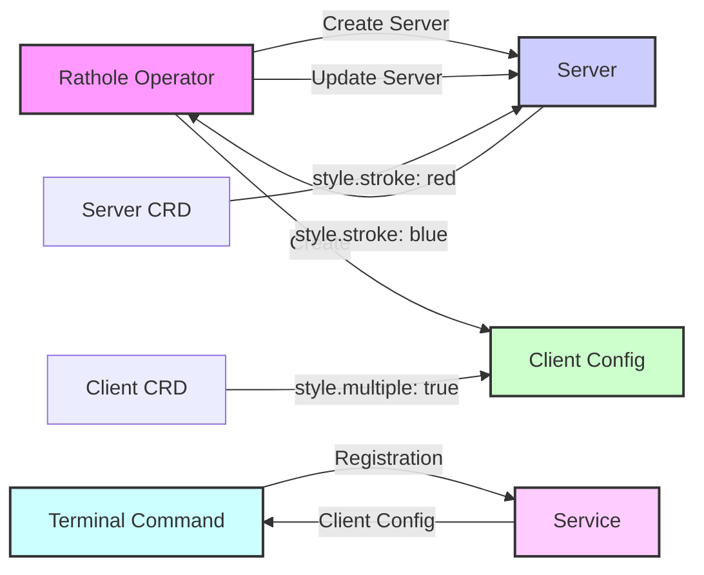

# rathole-operator

```mermaid
graph LR
  op[Rathole Operator]
  svrcrd[Server CRD]
  clicrd[Client CRD]
  server[Server]
  clisec[Client Config]

  op -- "Create Server" --> server
  op -- "Update Server" --> server
  op -- "Create" --> clisec

  clicrd -- "style.multiple: true" --> clisec
  svrcrd -- "style.stroke: red" --> server
  server -- "style.stroke: blue" --> op

  cli[Terminal Command]
  service[Service]

  cli -- "Registration" --> service
  service -- "Client Config" --> cli

  style op fill:#f9f,stroke:#333,stroke-width:2px
  style server fill:#ccf,stroke:#333,stroke-width:2px
  style clisec fill:#cfc,stroke:#333,stroke-width:2px
  style service fill:#fcf,stroke:#333,stroke-width:2px
  style cli fill:#cff,stroke:#333,stroke-width:2px

```